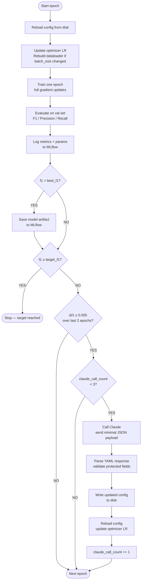

# Loop Engineering — What It Is and How This System Works

---

## 1. What Loop Engineering Is

Boris Cherny, head of Claude Code at Anthropic, described a shift in how he thinks about his own work: "I don't prompt Claude anymore. I have loops running that prompt Claude and figure out what to do. My job is to write loops."

That sentence is the definition of loop engineering.

The traditional relationship between a developer and an LLM is conversational. You describe a problem, you get a response, you apply it, you evaluate the result, and you iterate — manually, step by step. You are in the middle of every decision cycle. Your role is to notice when something needs to change and to initiate the change yourself.

Loop engineering replaces that relationship with a system. Instead of *you* noticing that a model's training has stalled and *you* deciding to lower the learning rate, you write code that notices the stall, calls Claude with the context it needs to reason about the problem, applies Claude's recommendation automatically, and continues without waiting for you. You have removed yourself from the decision cycle. You have written a loop that runs the cycle for you.

This is a fundamentally different engineering posture. You are no longer the decision-maker between iterations. You are the author of the decision-making system. Your leverage comes not from being smart in the moment but from designing a loop that makes good decisions consistently.

What this means practically: your job shifts from "what should I change?" to "what signal should trigger a change?", "what context does the decision-maker need?", "what constraints should I enforce?", and "how do I verify the decision was good?". These are architectural questions, not operational ones. The operator is the loop. Your job is the architect.

In this project, the loop is a fine-tuning training loop. The decision-maker is Claude. The signal is F1 plateau. The constraints are the protected config fields. The audit trail is MLflow. Every design choice in this system follows directly from those four decisions.

---

## 2. The Full Training Loop Walkthrough

The loop runs from the first epoch to the last, but what happens within each epoch is where the design decisions live.

At the start of every epoch — including the very first — the loop reloads the config file from disk. This is not incidental. It is the mechanism by which Claude's changes take effect. The config file is the shared interface between the loop and the advisor. Claude writes to it. The loop reads it. Every epoch is a fresh read. If Claude changed the learning rate at the end of epoch 3, epoch 4 starts with that new rate already applied.

After reloading, the loop updates the optimizer's learning rate in-place. If Claude changed the batch size, the DataLoader is rebuilt with the new batch size before training begins. The model itself never changes — only the optimizer state and data pipeline respond to config changes.

Then training happens: one full pass over the training set with gradient updates, real weight changes, real loss minimisation. For ViT this means attending over 14×14 image patches and updating 86 million parameters per step. For EfficientNetB0 in smoke test mode it means running a lightweight depthwise separable convolution stack over a 4-image batch. Either way, the math is real.

After training, the model evaluates on the held-out validation set. This is the signal the loop cares about. Macro F1 is computed — not accuracy, not loss, but the metric that handles class imbalance correctly and is the standard against which published EuroSAT results are measured. Precision and recall are also computed but they are secondary.

The F1 value is appended to a running history list. That list is the input to plateau detection.

Then comes the branching logic. First: has F1 reached the target? If yes, stop — there is nothing to improve. Second: is there a plateau? If yes, and if the Claude call budget is not exhausted, call Claude. Third: regardless of whether Claude was called, log everything to MLflow.

If Claude is called, the loop sends the minimal payload, receives a YAML config, validates it, writes it to disk, reloads it, and updates the optimizer. This all happens within the epoch loop, before the next epoch starts. The next epoch will see the updated config on its first line.

The model artifact is saved to MLflow whenever the current F1 exceeds the previous best. This is a one-directional gate — once a new best is set, the previous artifact is not deleted but the new one supersedes it in the run's artifact store. You can always recover any checkpoint from the MLflow UI.

---

## 3. Why Plateau Detection, Not Every Epoch

The naive approach is to call Claude after every epoch. If the loop can call Claude, why not call it constantly and let Claude guide every update?

The answer is tokens, noise, and money — in that order.

**Tokens.** Every Claude call costs input tokens (the payload you send) and output tokens (the YAML response). The payload here is approximately 300 tokens per call — small by design. The response is approximately 100 tokens. That is 400 tokens per call, at a rate of roughly $3 per million tokens for Claude Sonnet. Three calls over a 10-epoch run costs less than a cent. But if you called every epoch, that is 10 calls, and the token count climbs. More importantly, the *value per call* drops to zero when nothing has changed. Claude at epoch 4 looks at the same learning rate, the same plateau, and says the same thing it said at epoch 3. You have burned tokens to hear the same advice twice.

**Noise.** Early in training, F1 moves significantly between epochs regardless of hyperparameters — the model is learning basic representations. Calling Claude during this phase produces low-signal advice because the trajectory is still establishing itself. Calling after the trajectory has flattened produces high-signal advice because the plateau is a genuine signal that the current configuration has hit a local ceiling.

**Money.** This is not abstract. At 10 epochs and a token-efficient payload, the cost per run is approximately $0.004 at Sonnet pricing, or less at Haiku. At every-epoch calling that becomes $0.013. Over dozens of experimental runs, that difference compounds. Token efficiency is not just an engineering virtue; it is a cost discipline.

The plateau condition is: F1 has not improved by more than 0.005 over the last 2 consecutive epochs. The two-epoch window is important. A single epoch of flat F1 can be noise — stochastic minibatch variance, a difficult batch, random weight interactions. Two consecutive epochs of flat F1 is a structural signal. The model is not randomly stuck; it is consistently stuck. That is when advice has value.

The 0.005 threshold is also deliberate. F1 fluctuates by this much naturally even on a well-improving model. Setting the threshold below this level would trigger false positives — calling Claude when the model is actually improving fine. Setting it too high (say 0.02) would miss genuine plateaus that only need a small nudge. 0.005 is the signal floor.

---

## 4. What Claude Receives and Why Nothing More

The payload sent to Claude contains exactly this:

```json
{
  "task": "image_classification",
  "model": "google/vit-base-patch16-224",
  "dataset": "blanchon/EuroSAT_RGB",
  "current_epoch": 4,
  "history": [
    {"epoch": 1, "f1": 0.42, "lr": 2e-5, "batch_size": 16},
    {"epoch": 2, "f1": 0.44, "lr": 2e-5, "batch_size": 16},
    {"epoch": 3, "f1": 0.445, "lr": 2e-5, "batch_size": 16},
    {"epoch": 4, "f1": 0.447, "lr": 2e-5, "batch_size": 16}
  ],
  "target_f1": 0.85,
  "remaining_epochs": 6
}
```

Nothing else. No code. No architecture description. No training logs. No per-class breakdown. No loss curves. Nothing.

Why? Because every additional token you send has a cost — financial and cognitive. Claude does not need to read your training script to suggest lowering the learning rate. It needs the current F1 trajectory, the current hyperparameters, the target it is trying to hit, and how many epochs remain to hit it. That is the minimal sufficient context for a hyperparameter adjustment decision.

What happens when you send more? Two things. First, you increase the cost of every call — sometimes dramatically, if you include full logs. Second, and more insidiously, you give Claude more to reason about, which does not necessarily improve the quality of the recommendation. A recommendation to "lower learning rate by 5x" does not require reading 200 lines of training logs to be correct. It requires noticing that F1 has been flat for two epochs at a rate that suggests the optimizer is overshooting. The history contains that information.

There is also a discipline here worth naming: the constraint forces you to think carefully about what information is actually load-bearing for the decision. If you cannot fit the decision-relevant context into a small payload, that is a signal that either your decision logic is overcomplicated or your payload is bloated. The minimal payload is not just cost efficient — it is a clarity forcing function.

---

## 5. Why Claude Writes to YAML Directly

The critical architectural decision in this system is not "when to call Claude" — it is "what Claude does when called."

The obvious pattern is: Claude returns a suggestion, your code reads the suggestion, your code applies the suggestion to the running training state. Call it the advisor pattern. Claude advises. Python acts.

This project uses the opposite pattern: Claude is an agent with write access. Claude receives the training context, decides what to change, writes the full updated config to disk, and returns nothing except that file. Python reads the file on the next epoch. The loop does not "apply" Claude's suggestion — it simply reads the config it was already going to read.

Why does this matter?

Because the advisor pattern puts you (or your code) back in the middle. If Claude returns a suggestion as text — "lower the learning rate to 5e-6" — something has to parse that text, validate it, extract the numeric value, and apply it to the optimizer. That parsing step is fragile. What if Claude says "halve the learning rate"? What if the response format varies between calls? You have introduced a translation layer between the recommendation and the action, and that layer can break.

The config-as-interface pattern eliminates the translation layer. Claude's output IS the config. The format is defined by the existing YAML structure. Claude knows what a valid config looks like because you told it: "respond ONLY with the full updated config as valid YAML." If it deviates, the YAML parser raises an exception. There is no ambiguous text to parse. There is no recommendation to interpret. There is only a file on disk.

This also means the loop does not need to know that a Claude call happened in order to pick up the change. The epoch always starts by reading the config. Whether the config was changed by Claude or by a human or has not changed at all, the epoch reads it. Claude's agency is expressed entirely through that file. Claude is not a special case — it is just another writer to the config interface.

The one concession to safety is protected field validation: after Claude writes the config, the loop re-reads it and overwrites any changes to `model`, `dataset`, `num_epochs`, or `target_f1`. Claude cannot change the architecture or the evaluation target. It can only adjust the levers you have explicitly exposed.

---

## 6. The 3-Call Budget

The hard cap on Claude calls is not a technical constraint. It is a cost and quality discipline.

**The token math.** Each call sends approximately 300 input tokens (the payload) and receives approximately 100 output tokens (the YAML response). At Claude Haiku pricing (~$0.25 per million input tokens, ~$1.25 per million output tokens):

- Input cost per call: 300 × ($0.25 / 1,000,000) = $0.000075
- Output cost per call: 100 × ($1.25 / 1,000,000) = $0.000125
- Total per call: ~$0.0002
- Total for 3 calls: ~$0.0006 — less than a tenth of a cent per run

At Claude Sonnet pricing the numbers are roughly 10× higher, still less than a cent per run. The budget is not about financial constraint at this scale — it is about enforcing the discipline of purposeful calls.

**Why cap at 3?** A 10-epoch run can plateau at most a few times meaningfully. If F1 plateaus at epoch 3, Claude adjusts. If it plateaus again at epoch 5, Claude adjusts again. If it plateaus a third time at epoch 8, Claude has one more attempt. If F1 is still not moving after 3 Claude adjustments, the problem is not the learning rate or the batch size — the problem is that the model, dataset, and task combination is not going to reach the target in this run. Calling Claude a fourth time to suggest a fifth hyperparameter tweak will not fix that. The cap prevents futile spending on a run that has already told you what it knows.

**What early stopping prevents.** The target F1 check runs before the plateau check in every epoch. If the model hits the target, training stops — no more Claude calls, no more epochs. This is important because it means the Claude budget is only consumed on runs that are struggling, not on runs that are succeeding. A run that reaches F1 0.85 by epoch 6 uses zero Claude calls (assuming no plateaus along the way). The budget is preserved for the runs that need it.

---

## 7. MLflow as the Audit Trail

MLflow in this system is not just a logging framework. It is the reconstruction record — the thing that lets you look at a completed run and answer "what happened, when did it happen, and why did it happen."

Every epoch writes to MLflow:

- `f1_macro`, `precision_macro`, `recall_macro`: the quality signal
- `train_loss`: the optimisation signal
- `learning_rate`, `batch_size`: the current hyperparameters (these change when Claude calls)
- `claude_tokens_used`: 0 in most epochs, nonzero exactly when Claude was called
- `claude_suggested`: 1.0 in the epoch where Claude wrote to config, 0.0 otherwise

The shape of a run in the MLflow metrics view tells a story. F1 climbs for a few epochs, flattens, `claude_tokens_used` spikes (Claude was called), `learning_rate` drops in the next epoch (Claude lowered it), and F1 starts climbing again. Every step of that sequence is visible in the metrics without reading any code.

The model artifact — saved only when F1 improves — gives you a checkpoint for every best point in the run's history. You can load the best model from any run directly from MLflow without touching the filesystem manually:

```python
import mlflow.pytorch
model = mlflow.pytorch.load_model("runs:/<run_id>/best_model")
```

**How to read a run.** Open the `loop_engineering_v1` experiment. Select a run. Go to the Metrics tab. The plot you care about most is `f1_macro` vs step (epoch). Look for the inflection point — where F1 was flat and then started rising again. Find the epoch number of that inflection. Look at `claude_tokens_used` for that epoch. If the token count is nonzero, Claude called it. Look at `learning_rate` for the epoch after — that is what Claude changed it to. You have just reconstructed a decision Claude made and the effect it had on the model, in under a minute, without reading any code.

This is what "audit trail" means in practice. Not just logged data — reconstructable decisions.

---

## 8. The Full Closed Loop



The loop has no human step anywhere in the cycle. The only human actions are: starting the run, setting the API key, and reading the MLflow results. Everything between start and stop is autonomous.

---

## 9. What This Is Not

This project is a classifier. It trains a model to look at a single 64×64 satellite image and assign it one of ten land cover labels. It does not compare images across time. It does not detect change. It does not have a concept of "before" and "after". It has no temporal dimension whatsoever.

The classifier's accuracy matters because it is the backbone of the next project — a satellite change detection pipeline. Change detection works by comparing feature representations of the same location at two different times. If the features are good, the comparison is meaningful. The ViT fine-tuned here learns to extract features that are discriminative for Sentinel-2 land cover classes. Those features, applied to two images of the same location one year apart, can distinguish "this was forest, now it is cleared" from "this was always forest and still is."

What carries from this project to the change detection follow-on:

- **The fine-tuned ViT backbone.** The weights saved in MLflow are the starting point for the change detection model's feature extractor. You are not starting from scratch — you are starting from a model that already understands Sentinel-2 land cover at 64×64 resolution.

- **The MLflow experiment structure.** The `loop_engineering_v1` experiment establishes the pattern for tracking runs. The change detection project will use the same structure, the same parameter logging conventions, and the same artifact saving approach — extending it with temporal pair metrics rather than single-image metrics.

- **The Docker setup.** The Dockerfile and `docker-compose.yml` here can be adapted for the change detection pipeline with minor changes: a different dataset, a different model head, a different evaluation metric. The infrastructure — containerised training with a separate MLflow service — carries over as-is.

- **The loop engineering pattern itself.** Plateau detection and autonomous hyperparameter adjustment are not specific to classification. Any training loop that has a metric, a target, and a budget can use this pattern. The change detection loop will inherit it.

What this project does not provide: labeled change detection pairs, temporal alignment logic, the change detection model architecture, or the inference pipeline. Those are built on top of what this project produces. The foundation is here. The structure above it belongs to the follow-on.
