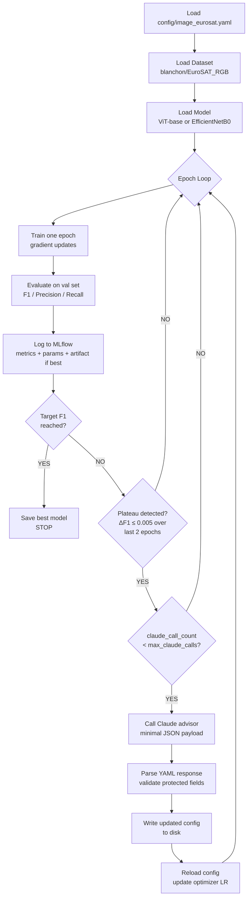

# Loop Engineering — EuroSAT Adaptive Fine-Tuning

This project implements a production-style ML training loop where a pretrained Vision Transformer is fine-tuned on the EuroSAT satellite image dataset, and Claude acts as an autonomous hyperparameter advisor embedded in the loop. When validation F1 plateaus, the loop calls Claude with the training history, Claude writes updated hyperparameters directly to the config file, and training continues without any human intervention. Every decision — model performance, hyperparameter changes, Claude token usage — is logged in MLflow for full auditability.

## Architecture



## Prerequisites

- Python 3.12
- `uv` (or any virtualenv tool)
- `ANTHROPIC_API_KEY` — required for the Claude advisor loop
- Docker + Docker Compose — for containerised training only

## Quickstart

```bash
git clone <this-repo>
cd loop

uv venv .venv --python 3.12
uv pip install -r requirements.txt
```

## Smoke Test

Validates the full pipeline end-to-end in under 2 minutes. Uses EfficientNetB0, 30 images, CPU, 2 epochs. Forces plateau detection after epoch 1 to exercise the Claude advisor call.

```bash
ANTHROPIC_API_KEY=sk-ant-... .venv/bin/python src/train.py --smoke-test
```

Expected output:
```
Device: cpu | Epochs: 2 | Smoke test: True
Epoch 1/2 | LR: 2e-05 | Batch: 4
  train_loss=... | f1_macro=...
  Plateau detected — calling Claude advisor (call 1)
  Claude responded (N tokens). Config updated.
  New best F1: ... — model artifact saved
Epoch 2/2 | LR: ... | Batch: 4
  train_loss=... | f1_macro=...
Run complete. Best F1: ... | Claude calls: 1
```

## Full Training (Local)

```bash
ANTHROPIC_API_KEY=sk-ant-... .venv/bin/python src/train.py --config config/image_eurosat.yaml
```

Trains `google/vit-base-patch16-224` on all 16,200 EuroSAT training images for up to 10 epochs. Claude is called (up to 3 times) whenever F1 stalls. Target F1: 0.85.

## Docker

Build and run training with MLflow as a sidecar service:

```bash
ANTHROPIC_API_KEY=sk-ant-... docker-compose up
```

Training runs in the `training` service. MLflow server runs in the `mlflow` service. Experiment data is persisted to `./mlruns` on the host via volume mount. Config changes written by Claude are also persisted via the `./config` volume mount.

## MLflow UI

**Locally:**

```bash
.venv/bin/mlflow ui --port 5000
# Open http://localhost:5000
```

**With Docker:** the MLflow service starts automatically at `http://localhost:5000` when you run `docker-compose up`.

**How to read a run:**

1. Open the `loop_engineering_v1` experiment
2. Select a run (e.g. `vit_base_eurosat`)
3. The **Metrics** tab shows `f1_macro`, `train_loss`, `learning_rate`, and `claude_tokens_used` plotted per epoch — a spike in `claude_tokens_used` marks when Claude was called
4. Epochs where `claude_suggested = 1.0` show which hyperparameter changes came from Claude
5. The **Artifacts** tab contains the best checkpoint saved under `best_model/`

## Connection to Satellite Change Detection

This project is the foundation for a larger open-source satellite change detection pipeline. The ViT backbone fine-tuned here on EuroSAT land cover classes (Sentinel-2 imagery) becomes the feature extractor in a change detection model that compares two time-series satellite images. The MLflow experiment structure, Docker setup, and adaptive loop pattern established here carry directly into that follow-on project — arriving there with a trained Sentinel-2 vision model, a working experiment tracking setup, and the loop engineering pattern already in place.
